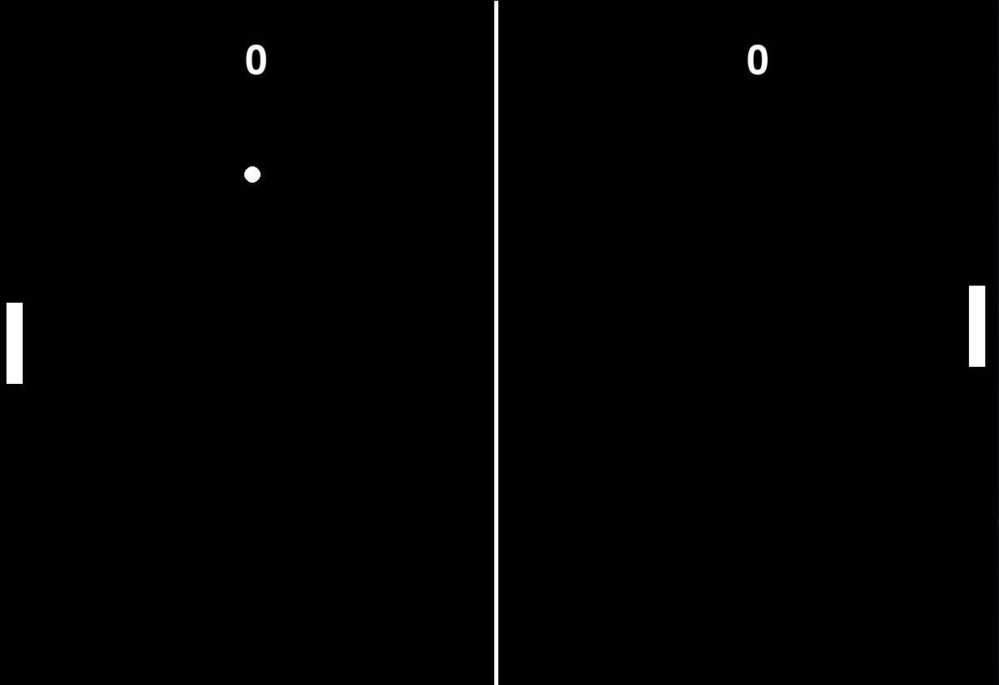

# Pong

## Description

This is a Pong clone with a robot that plays against you almost perfectly.

## Table of Contents

- [Installation](#installation)
- [Usage](#usage)
- [Features](#features)
- [Contributing](#contributing)
- [License](#license)
- [Contact](#contact)
- [Acknowledgments](#acknowledgments)

## Installation

1. Clone the repo

   ```sh
   git clone https://github.com/Ekansh38/Pong.git

   ```

2. Install Dependencies

   ```sh
   pip install pygame

   pip3 install pygame

   python3 -m pip install pygame
   ```

3. Run the project
   ```sh
   python3 main.py
   ```

## Usage

You could play against the AI to see if you can win or not let the AI win. The AI is almost perfect and will not let you win easily.



## Features

- Play against the AI
- AI is almost perfect
- Score is displayed on the screen
- Game Over screen

## Contributing

I would love for anyone to contribute to this project and make it better in anyway possible. (because I am not that good at coding)

## License

Distributed under the MIT License. See LICENSE for more information.

## Contact

Ekansh - [Twitter or X](https://x.com/mister_byte_) - [YouTube Channel](https://www.youtube.com/@mister_byte_) - goenka.ekansh@gmail.com

## Acknowledgments

- [Pygame Documentation](https://www.pygame.org/docs/)
